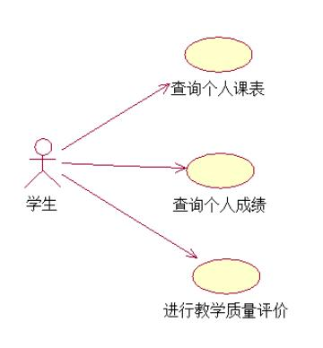

# Academic-Teaching-Affair-Management-System
NIIT项目：教务管理系统

技术要求：spring + spring MVC + Mybatis + bootstrap + mysql

需求分析：

1，需求简介

教务管理教务管理系统面向教务处、院、系教师和全校学生，实现学籍管理、课表管理、成绩管理、教学质量监控等功能。

2，需求功能详细介绍

由于教务管理系统面对的用户是管理员、教师和学生，因此要求用户界面间接整齐，美观大方，用户体验度好。

在使用教务管理系统时，有频繁的大量的数据查询，因此要求服务器能积极及时的响应大批量的用户请求。

软件方面要求系统整体使用起来流畅度高。

在安全方面，要求能完整保存用户数据而不被泄露。

3，项目分析，包括各种图例分析

开发教务管理系统旨在改变原有人工进行教务管理的工作方式，实现学籍管理、课表管理、成绩管理、教学质量监控等功能。下图是教务管理系统功能模块图：

教务管理系统分为管理员模块、教师模块和学生模块，实现录入课表、录入成绩、查询课表、查询成绩、进行教学质量评价等功能，为更形象的表现各功能间的关系，建立以下用例模型：

（1）管理员管理用例图

（2）教师管理用例图

（3）学生管理用例图

以下分别为查询成绩活动图、录入课表活动图和录入成绩活动图：

（1）教务管理系统中，管理员、教师和学生都可以查询成绩，但是权限不同，登录成功后，管理员可以查看全校各专业学生各学期成绩，教师可以查看所带班级学生各学期成绩，学生只可以查看自己各门课程各学期成绩。

（2）管理员登录成功后，需要录入课表，根据各班级排课情况录入课表，供学生和教师查询，方便教务工作，下图为录入课表活动图：

（3）成绩由教师来录入，所以教师登录教务管理系统后，点击录入成绩，根据表格内容，录入各学生各门课的成绩，供其他用户查询。

（4）学生可以对代课教师进行教学质量评价，输入自己的用户名和密码登录成功后，点击教学质量评价，屏幕显示该学生的各专业教师，选择评价描述后的优良中，即可进行教学质量评价。

（5）只有管理员可以修改学生成绩，管理员可以通过数据库直接修改某一学生成绩，也可以登录系统后，点击修改成绩，输入学生学号，修改相应成绩。

（6）学生信息和教师信息由管理员录入，管理员登录成功后，点击录入学生信息，根据屏幕显示表格，录入学生姓名、学号、班级和专业。

下图为教务管理系统中对象类模型：

4，项目组成员及成员github地址，维护者的github地址
   马少东 https://github.com/toujian
